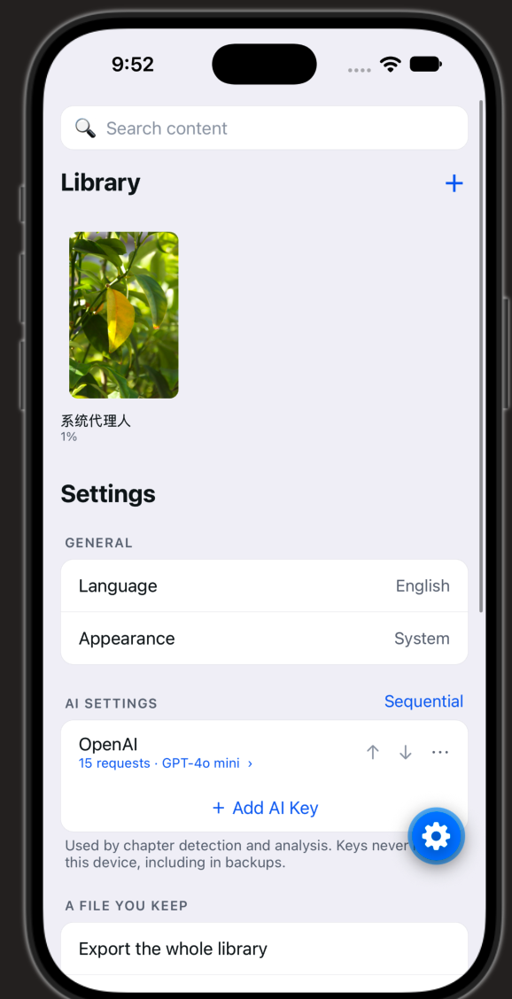
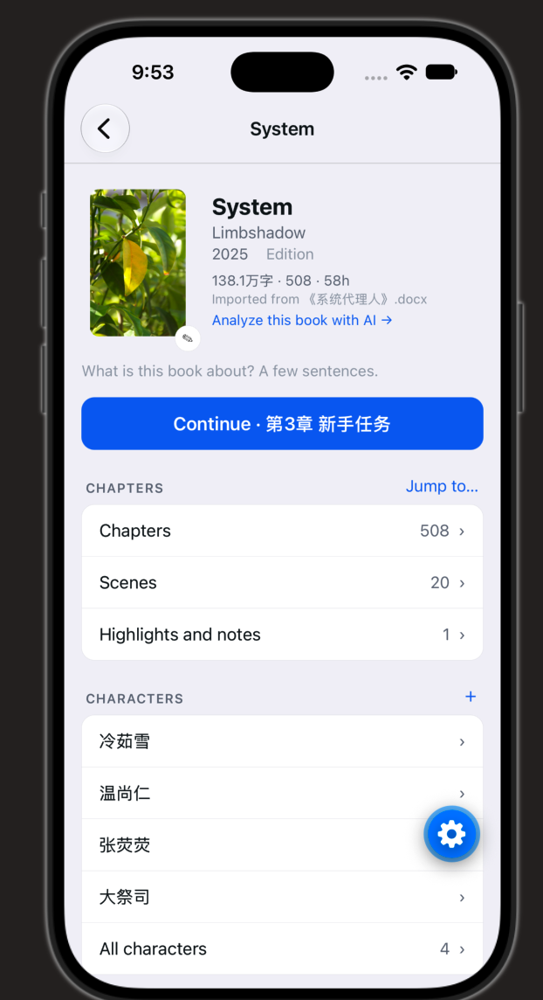

# Turn a Manuscript Into a Story Bible

Drop in a novel. Read it properly, and get back its structure, its cast, and
— eventually — the visual material a screen adaptation needs.

An offline-first iOS/Android app for novel writers, editors and adapters.
English and Chinese. Your manuscript never leaves the device unless you send
it somewhere.


## What it does

**One page, no tab bar** — search, the books you're reading, your library, and
settings, stacked on a single screen. Every book then gets one page that is
the whole app for that book: read it, fix its structure, analyze it, export
it. Nothing about a book lives anywhere else.

**Characters and places get real profiles** — portrait, alias, summary, and
details you define yourself, because what matters about a character is
genre-specific: cultivation level, house, ship, species.

**Import from wherever it already is** — the system file picker (which brings
iCloud, Google Drive, Dropbox and OneDrive with it), "Open in…" from another
app, a pasted link, or your own cloud backup. `.txt`, `.md`, `.docx`, `.epub`
and `.pdf`. A Google Doc link comes in as `.docx`, with no Google-specific
detour. PDFs show you the text they extracted before it becomes a book.

**Structure, detected then corrected** — chapters and scenes found by
heuristics first (heading styles, `Chapter 12`, `第十二章`, `* * *`, epub
spine), AI only where the heuristics are unsure. Rename, merge, split and
reorder; your corrections survive every re-run.

**Reader mode** — a real reading experience, not a preview. Tap any single
sentence to copy, highlight, note, bookmark or share it — no drag handles.
Four themes, font size, margins, a progress scrubber over the whole book, and
chrome that fades while you read. Annotations anchor to their own words, so
they survive a re-import or a re-split.

**Export** — `.txt`, `.md`, `.docx`, `.epub`, `.html`, `.pdf`, plus your
annotations as `.md`/`.csv`, the cast as a bible, the translation on its own
or bilingual, and the screenplay as `.fountain`/`.fdx`. Every format states
what it drops before you pick it, and is rendered from the current structure
— so what comes out matches what you were reading.

**Backup** — one bundle format, three destinations: iCloud Drive, a file you
keep, or a cloud bucket you own. Per book, so a single book can come back
without touching the rest. Restore never overwrites — it creates something new
and tells you what it couldn't place.

**iCloud, one switch** — turn it on and everything you made — notes,
characters, structure, progress, settings — is copied into the app's own
iCloud Drive folder (Files → iCloud Drive → Novel Man) whenever any of it
changes, a few seconds after you stop typing. Nothing waits on it. Manuscripts
stay out: they came from files you still have, and they'd cost a hundred times
more to store. Delete the app, reinstall it, and the copy comes back on first
launch with no prompt; import a book file again and its notes, profiles and
chapter fixes land back on it, matched on the file's own hash.

**Translation that gets better as you use it** — translate into your chosen
languages with a glossary the model must obey: character names,
places and terminology, each editable and lockable per language, seeded from
the cast analysis. Read bilingually, fix any sentence, and the fix is kept as
a diff against the machine output — promote it to a glossary term and every
later chapter follows it, or leave it as a worked example the model is shown
on similar lines. Change a name late and only the affected chapters re-run.

**Analysis that indexes the book** — character dossiers with per-chapter
mention timelines counted on-device, an interactive relation graph you can
filter by chapter range, continuity flags ("grey eyes in ch.3, green in
ch.20") raised for review rather than applied, a character bible export, and
screenplay conversion out to `.fountain` and `.fdx`.

**Planned** — generated portraits and storyboards (分镜) on the way to manga
and partial animation. Both wait on per-capability AI routing: image models
are a different endpoint per vendor, not a different model name.


## How it's built

React Native + Expo + TypeScript, one codebase for iOS and Android.

- **Local-first.** Manuscripts, structure, annotations and generated assets
  live in on-device SQLite. No account, no server, no sign-up.
- **Optional sync.** Opt in to a private S3-compatible bucket *you own*. Off
  by default; manual by default.
- **iCloud needs a signed build.** The switch reads the container itself and
  hides the row where it could never work (Android, Expo Go). A build signed
  without the iCloud capability says so rather than telling you to sign in —
  shipping it means a paid Apple developer account, which changes how every
  build is signed, not just this feature.
- **Bring your own AI key.** OpenAI, Anthropic, Gemini and friends — usage
  bills to your account, keys stay in the device keychain and never appear in
  a backup or a sync payload. With no key configured the app degrades to its
  non-AI behavior rather than erroring.
- **Bilingual from the first screen.** English and 简体中文, English default.
  The interface language and the manuscript's language are separate settings.
- **Light and dark, separately from the reading theme.** The interface follows
  your phone or an explicit override; the page you read has its own four
  themes, because Sepia and Grey are neither light nor dark.

Every expensive AI pass is opt-in per run, states its cost before it spends,
and caches its results. Nothing analyzes a 300,000-word manuscript behind
your back.


## Design docs

- [Design](docs/design/DESIGN.md) — problem, scope, options, decisions
- [UI/UX](docs/design/UIUX_DESIGN.md) — screens, flows, states, copy
- [Implementation plan](docs/design/IMPLEMENT_PLAN.md) — phased task list


## Running it

```
npm install
npx expo start --ios     # or --android
npx expo run:ios         # dev build — the iCloud switch needs one
```

Opens in Expo Go — no native build needed. Import a `.txt`, `.md`, `.docx`,
`.epub` or `.pdf` from Files and it lands on the shelf with its chapters
detected. Imports run through a visible queue, so the app stays usable while
a long novel is being read in.

```
npm run check           # typecheck + parsers + catalogs, all of it
```

`check:parse` runs the pure modules outside the app against fixtures —
parsers, chapter and scene detection, annotation re-anchoring, docx/epub
export round trips, translation alignment, SigV4 against the published AWS
vectors, screenplay output. `check:i18n` proves both language catalogs
carry the same keys and that no visible string is hard-coded in a screen.


## Status

Everything above runs. What is not built: parsing on a background thread
(needs a dev build), generated portraits and storyboards, and `.rtf` / `.odt`
/ `.fb2` import. The [plan](docs/design/IMPLEMENT_PLAN.md) marks exactly what
landed and what each partial task still owes.

Three things need a dev build rather than Expo Go: the iCloud switch (its
native module lives in `modules/icloud/`, and the row hides itself where it
could never work), the share extension that puts Novel Man in another app's
share sheet (the file types are declared, the extension is not), and moving
parsing off the JS thread.


## Screenshots

| Library and settings | Book page |
| --- | --- |
|  |  |

One page: search, the shelf, and every setting under it. A book opens to its
cover, chapters, scenes, notes and characters.
